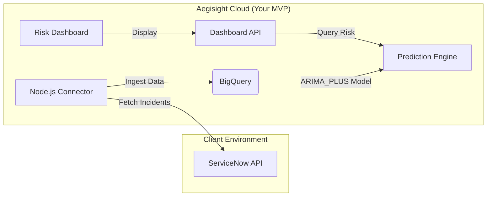

# Aegisight AI: MVP Master Execution Plan
## Version: 1.1 (ServiceNow Beachhead Edition)
**Focus:** Predictive Incident Prevention System (The "Risk Grader")  
**Persona:** Sarah, IT Ops Director  
**Primary Integration:** ServiceNow ITSM

### 1. Executive Summary: The Strategic Shift
*   **The Problem:** Enterprises do not buy "Risk Graders" (status reports); they buy guaranteed outcomes (cost prevention).
*   **The Solution:** The MVP is a "Predictive Intelligence Layer" that sits on top of ServiceNow.
*   **The "Aha!" Moment:** We do not just grade the risk; we tell Sarah, "ServiceNow shows all green, but our engine predicts a Critical Incident in 3 hours."

### The MVP Definition
*   **Input:**
    *   *Dev Phase:* Simulated Data (to build fast).
    *   *Pilot Phase:* Real-time Ticket Data pulled from ServiceNow API.
*   **Processing:** Uses BigQuery ML (ARIMA_PLUS) to forecast "failure patterns" (High CPU + High Ticket Volume).
*   **Output:**
    *   *Aegisight Dashboard:* The "Risk Grader" Gauge.
    *   *ServiceNow Alert:* Pushes a "High Risk" incident back into ServiceNow (optional for V2).

### 2. Strategic Alignment: Learning vs. Business
This MVP bridges your personal learning goals with the enterprise sales strategy.

| Component | Strategic Role (Business) | Learning Path Role (Technical) |
| :--- | :--- | :--- |
| **The Brain** | Core Value. Forecasting failures before they happen. | BigQuery ML: Mastering ARIMA_PLUS & SQL-based ML. |
| **The Body** | Scale. Handling data ingestion without crashing. | Cloud Run: Mastering Serverless Containers & Docker. |
| **The Connector** | Market Access. Connecting to the industry standard (ServiceNow). | API Integration: Learning OAuth & REST Data Fetching. |

### 3. Go-To-Market: The "ServiceNow Shadow" Strategy
How to sell this MVP to an Enterprise without a long sales cycle.

*   **The Pitch:** "We predict the incidents ServiceNow misses."
*   **The Scope (Low Risk):** Target a client with a ServiceNow Sandbox/Staging environment.
*   **The Baseline:** Measure their current Mean Time To Resolution (MTTR) inside ServiceNow.
*   **The Validation (Shadow Mode):** Your Agent pulls last month's closed tickets from ServiceNow.
*   **The Close:** Show the report: "We predicted 5 outages. You prevented 4. Here is the money you saved."

### 4. Technical Architecture & Data Flow

*   **Connector:** Fetches incident table data from ServiceNow (JSON format).
*   **The Brain:** BigQuery ML calculates the probability of anomaly.
*   **The Dashboard:** Displays the Red/Green status to the user.

### 5. Execution: The Antigravity Agent Instructions
**Phase 1: The Simulator (Data Generation)**
*   Create `scripts/simulate_data.js`.
*   Generate continuous time-series data (cpu_load, ticket_velocity).
*   Simulate "Failure Patterns" (High CPU + High Velocity).

**Phase 2: The ServiceNow Connector**
*   Create `src/services/servicenow.js`.
*   Fetch recent incidents via ServiceNow Table API.

**Phase 3: The Brain (BigQuery ML)**
*   Create `src/models/risk_engine.sql`.
*   Define `ARIMA_PLUS` model and `ML.DETECT_ANOMALIES` query.

**Phase 4: The Bridge (Integration Layer)**
*   Create `src/services/predictionService.js` and `GET /api/risk-status`.

**Phase 5: The Risk Grader (Dashboard UI)**
*   Create `GET /dashboard`.
*   Visualize Risk Score (Gauge) and Evidence (Line Chart).

### 6. Pre-Flight Checklist
*   [ ] Google Cloud Key (key.json)
*   [ ] BigQuery Dataset (aegisight_mvp)
*   [ ] ServiceNow Developer Account (PDI)
*   [ ] Dependencies (@google-cloud/bigquery, axios)

---
### Platform Foundation (Existing Context)
*   **Auth System:** Secure login/signup provides access to this new Dashboard.
*   **Hosting:** Node.js/Express environment is ready for these new services.
